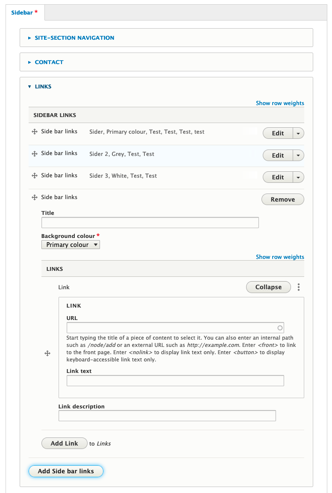
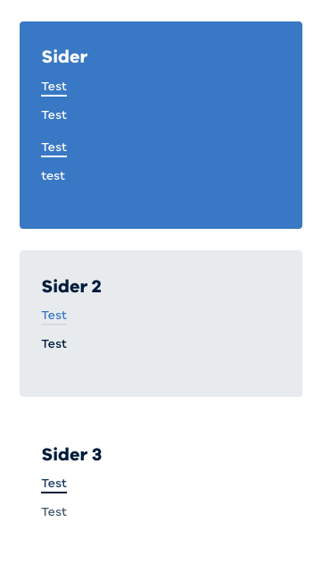

# Sidebar Links

Works alongside the `field_sidebar_links` field for Standard Pages.

See:

## Back-end sidebar field on Landing Page

## Front-end sidebar displaying on page

## Used on sites

* health.vic
* seniorsonline.vic
